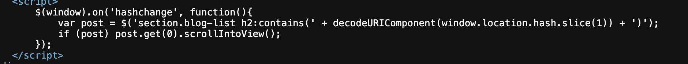
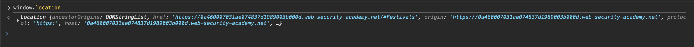
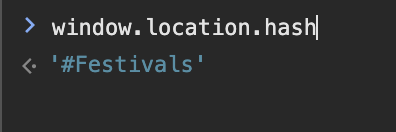
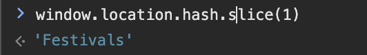
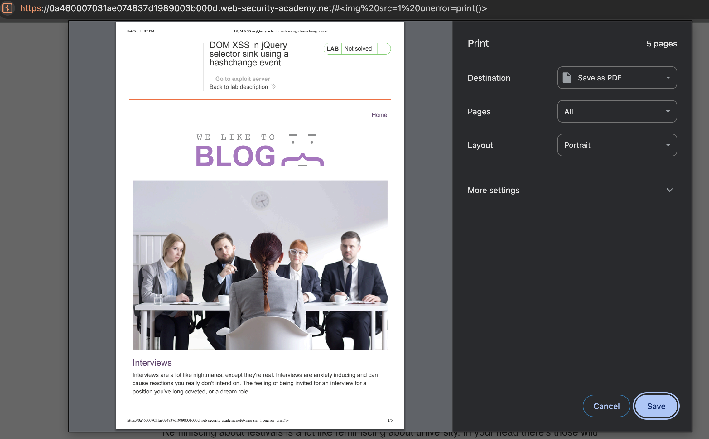
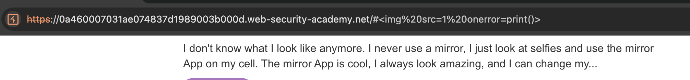
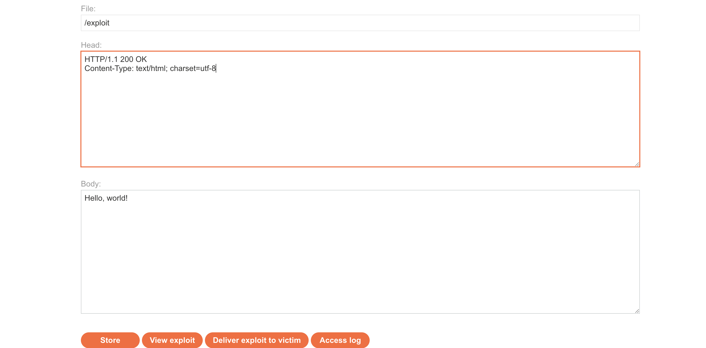
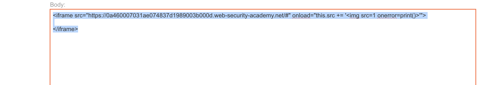
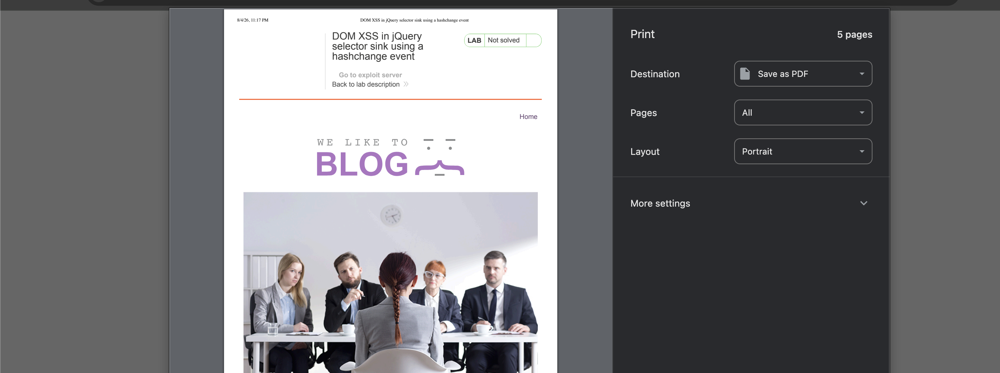
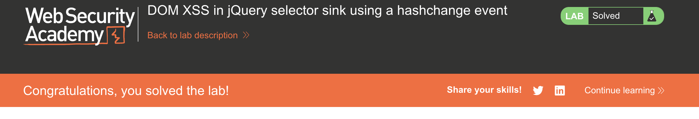

# PortSwigger – Cross-Site Scripting (XSS) Vulnerabilities Labs
---
## LAB 1 — Reflected XSS into HTML Context with Nothing Encoded
> **Level:** `APPRENTICE`

### Analysis

| | |
|---|---|
| **Vulnerability** | Reflected XSS |
| **Goal** | Trigger an `alert()` in the browser |
| **Key Concept** | User input is reflected directly into the HTML response with no encoding or sanitization — injecting `` executes immediately |
| **Key Takeaway** | The simplest form of XSS — if input appears in the page unchanged, the browser treats it as HTML/JS |

### Steps

1) the lab contain search input to find anything in blog when i write word on it it's appear on the page : 

2) if i go to source code i see that it's appear in `h1` tag  : 

3) i will close this tag and start script tag to write java script with `'</h1>` an i got alert SOLVED: 

---
## LAB 2 — Stored XSS into HTML Context with Nothing Encoded
> **Level:** `APPRENTICE`

### Analysis

| | |
|---|---|
| **Vulnerability** | Stored XSS |
| **Goal** | Trigger an `alert()` when any user views the page |
| **Key Concept** | Malicious input is saved to the database and rendered unsanitized on every page load — the payload persists and fires for every visitor |
| **Key Takeaway** | Stored XSS is more dangerous than reflected — it requires no user interaction beyond visiting the page |

### Steps
1) start lab and click view any post and write a comment like this : 

2) after submit comment it's appear on the page : 

3) it's appear in 2 places i will inject script after anchor element `<a>` and that's name input not work `</a>`: 

4) try to inject comment it self and it's work SOLVED no need to anchor element but i don't change last inject: 

---
## LAB 3 — DOM XSS in `document.write` Sink Using Source `location.search`
> **Level:** `APPRENTICE`

### Analysis

| | |
|---|---|
| **Vulnerability** | DOM-based XSS |
| **Goal** | Trigger an `alert()` via a DOM sink |
| **Key Concept** | JavaScript reads `location.search` and passes it to `document.write()` without sanitization — breaking out of the HTML context with `">` allows injecting arbitrary tags |
| **Key Takeaway** | DOM XSS happens entirely in the browser; the server never sees or sends the payload — classic source-to-sink flow |

### Steps

1) first search for anything like `t4t4r1s` and it's appear in search :
 

2) right click and view page source and see that we have function take query as a parameter we can change query to break syntax  : 

3) `document.write('');` we can change our input to break /assets/labs/xsss/image like 
`>`:

4) got an alert. SOLVED : 

---
## LAB 4 — DOM XSS in `innerHTML` Sink Using Source `location.search`
> **Level:** `APPRENTICE`

### Analysis

| | |
|---|---|
| **Vulnerability** | DOM-based XSS |
| **Goal** | Trigger an `alert()` via `innerHTML` |
| **Key Concept** | `innerHTML` does not execute `` and opening a new one bypasses the escaping logic |
| **Key Takeaway** | When string-level escaping is in place, stepping outside the script block entirely is a valid alternative — the browser parses `</script>` as closing the block regardless of JS string context |

### Steps

---
## LAB 19 — Reflected XSS into a JavaScript String with Angle Brackets and Double Quotes HTML-Encoded and Single Quotes Escaped
> **Level:** `PRACTITIONER`

### Analysis

| | |
|---|---|
| **Vulnerability** | Reflected XSS inside a JS string with multiple escaping layers |
| **Goal** | Trigger an `alert()` |
| **Key Concept** | Angle brackets, double quotes, and single quotes are all sanitized — but a backslash `\` is not escaped, allowing injection of `\` to cancel the app's own escaping of the next single quote, breaking out of the string |
| **Key Takeaway** | If the application escapes `'` to `\'` but doesn't escape `\`, injecting `\` before the quote turns `\'` into `\\'` — the backslash is escaped and the quote breaks the string |

### Steps

---
## LAB 20 — Stored XSS into `onclick` Event with Angle Brackets and Double Quotes HTML-Encoded and Single Quotes and Backslash Escaped
> **Level:** `PRACTITIONER`

### Analysis

| | |
|---|---|
| **Vulnerability** | Stored XSS inside an `onclick` event handler |
| **Goal** | Trigger an `alert()` when the author link is clicked |
| **Key Concept** | Input lands inside an `onclick` attribute where quotes and backslashes are escaped — HTML encoding is decoded by the browser before JS executes, so `&apos;` (HTML entity for `'`) bypasses the escaping and breaks out of the JS string |
| **Key Takeaway** | HTML entities inside event handler attributes are decoded before JavaScript execution — `&apos;` is a valid single quote bypass when `'` and `\'` are both blocked |

### Steps

---
## LAB 21 — Reflected XSS into a Template Literal with Angle Brackets, Single, Double Quotes, Backslash and Backticks Unicode-Escaped
> **Level:** `PRACTITIONER`

### Analysis

| | |
|---|---|
| **Vulnerability** | Reflected XSS inside a JavaScript template literal |
| **Goal** | Trigger an `alert()` |
| **Key Concept** | Input is placed inside a backtick template literal with all common escape characters blocked — template literals support `${...}` expressions, so injecting `${alert(1)}` executes code without needing any quotes or brackets |
| **Key Takeaway** | Template literals execute `${}` expressions directly — when input lands inside backticks, expression injection is the cleanest bypass regardless of other encoding |

### Steps

---
## LAB 22 — Exploiting Cross-Site Scripting to Steal Cookies
> **Level:** `PRACTITIONER`

### Analysis

| | |
|---|---|
| **Vulnerability** | Stored XSS leading to session hijacking |
| **Goal** | Steal the victim's session cookie and use it to hijack their account |
| **Key Concept** | A stored XSS payload in a comment sends `document.cookie` to an attacker-controlled server (Burp Collaborator) — the stolen cookie is then used to impersonate the victim |
| **Key Takeaway** | XSS that reaches a victim's browser can exfiltrate cookies unless `HttpOnly` is set — always pair XSS mitigations with `HttpOnly` and `Secure` cookie flags |

### Steps

---
## LAB 23 — Exploiting Cross-Site Scripting to Capture Passwords
> **Level:** `PRACTITIONER`

### Analysis

| | |
|---|---|
| **Vulnerability** | Stored XSS leading to credential capture |
| **Goal** | Capture the victim's username and password via a fake auto-fill form |
| **Key Concept** | An XSS payload injects hidden username and password fields — when a password manager auto-fills them, another event handler exfiltrates the values to Burp Collaborator |
| **Key Takeaway** | XSS can abuse browser password managers to harvest credentials without the user typing anything — a creative escalation beyond simple cookie theft |

### Steps

---
## LAB 24 — Exploiting XSS to Bypass CSRF Defenses
> **Level:** `PRACTITIONER`

### Analysis

| | |
|---|---|
| **Vulnerability** | Stored XSS used to perform CSRF |
| **Goal** | Use XSS to change the victim's email address |
| **Key Concept** | CSRF tokens prevent cross-site form submissions, but XSS runs in the victim's origin — the payload fetches the CSRF token from the page, then submits the email-change form with it |
| **Key Takeaway** | CSRF protection is bypassed by XSS because XSS executes within the same origin — XSS makes CSRF tokens useless; you need to fix XSS first |

### Steps

---
## LAB 25 — Reflected XSS with AngularJS Sandbox Escape Without Strings
> **Level:** `EXPERT`

### Analysis

| | |
|---|---|
| **Vulnerability** | AngularJS sandbox escape |
| **Goal** | Trigger an `alert()` without using any strings |
| **Key Concept** | AngularJS's sandbox restricts access to dangerous properties — using property accessors via array notation (`[...]`) and `toString` chains allows constructing function calls and strings without string literals |
| **Key Takeaway** | AngularJS sandbox escapes rely on the JS engine's type coercion and prototype chain — the sandbox is not a security boundary; Portswigger recommends avoiding AngularJS client-side templating with user input entirely |

### Steps

---
## LAB 26 — Reflected XSS with AngularJS Sandbox Escape and CSP
> **Level:** `EXPERT`

### Analysis

| | |
|---|---|
| **Vulnerability** | AngularJS sandbox escape with CSP bypass |
| **Goal** | Trigger an `alert()` bypassing both the AngularJS sandbox and CSP |
| **Key Concept** | CSP blocks inline scripts and external sources — but AngularJS's `ng-focus` event combined with a sandbox escape using `$event.composedPath()` can call `alert` from an allowed script source |
| **Key Takeaway** | CSP + AngularJS is a complex interaction — AngularJS event directives execute in the AngularJS context which may bypass CSP restrictions; the combination of sandbox escape and CSP bypass requires chaining multiple techniques |

### Steps

---
## LAB 27 — Reflected XSS with Event Handlers and `href` Attributes Blocked
> **Level:** `EXPERT`

### Analysis

| | |
|---|---|
| **Vulnerability** | Reflected XSS with blocked event handlers and href |
| **Goal** | Trigger a `click` on a payload that calls `alert()` |
| **Key Concept** | Event handlers and `href` are blocked — SVG `<animate>` elements can set attributes like `href` on a parent element at animation time, injecting a `javascript:` URI that bypasses the blocklist |
| **Key Takeaway** | SVG animation elements like `<animate>` and `<set>` can dynamically assign attributes after the initial parse — a technique to bypass WAFs that check static attribute values |

### Steps

---
## LAB 28 — Reflected XSS in a JavaScript URL with Some Characters Blocked
> **Level:** `EXPERT`

### Analysis

| | |
|---|---|
| **Vulnerability** | Reflected XSS inside a `javascript:` URL |
| **Goal** | Trigger an `alert()` with the victim's `postId` |
| **Key Concept** | The input is placed in a `javascript:` URL with certain characters blocked — using `throw` with an `onerror` handler and `%0a` (newline) to break out of blocked expression syntax enables execution without the blocked characters |
| **Key Takeaway** | `javascript:` URL context has its own parsing rules — newlines, `throw`, and exception handlers are powerful tools when standard function call syntax is blocked |

### Steps

---
## LAB 29 — Reflected XSS Protected by Very Strict CSP, with Dangling Markup Attack
> **Level:** `PRACTITIONER`

### Analysis

| | |
|---|---|
| **Vulnerability** | Dangling markup injection under strict CSP |
| **Goal** | Steal a CSRF token and use it to change the victim's email |
| **Key Concept** | CSP blocks script execution entirely — a dangling markup attack injects an unclosed attribute (` **Level:** `EXPERT`

### Analysis

| | |
|---|---|
| **Vulnerability** | CSP bypass via policy injection |
| **Goal** | Trigger an `alert()` despite CSP |
| **Key Concept** | User input is reflected into the CSP header itself — injecting `;script-src-elem 'unsafe-inline'` into the CSP via the reflected parameter overrides the existing script policy and allows inline script execution |
| **Key Takeaway** | If user input influences the CSP header value, the policy itself can be bypassed — a critical misconfiguration where the protection mechanism becomes the attack vector |

### Steps

---
**Finished — Happy Hacking!**

---
**Find me online:**
- TryHackMe: [t4t4r1s](https://tryhackme.com/p/t4t4r1s)
- HackTheBox: [t4t4r1s](https://app.hackthebox.com/users/2203575)
- LinkedIn: [Mustafa Eltayeb](https://www.linkedin.com/in/t4t4r1s)
- X: [@mustafa_altayeb](https://x.com/t4t4r1s)

---
<iframe src="https://tryhackme.com/api/v2/badges/public-profile?userPublicId=3186403" style="border:none;"></iframe>